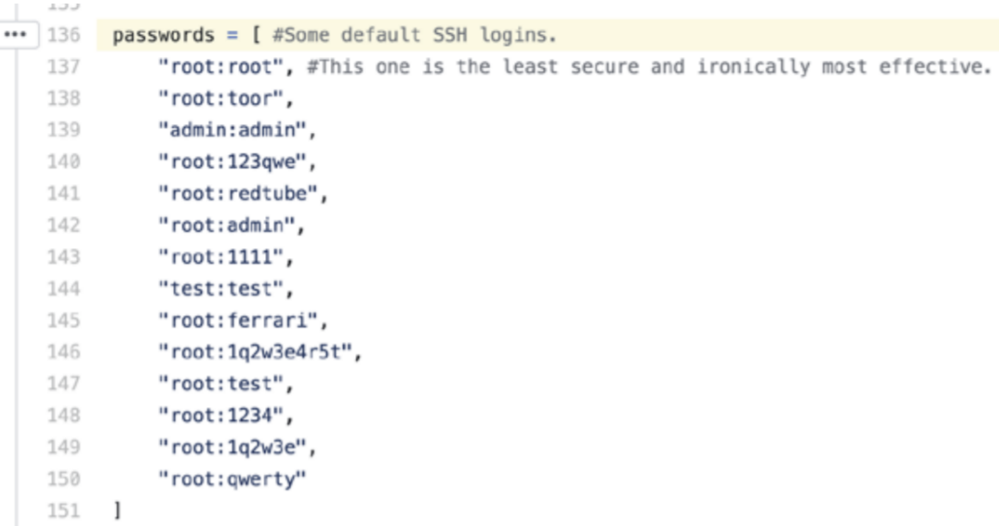
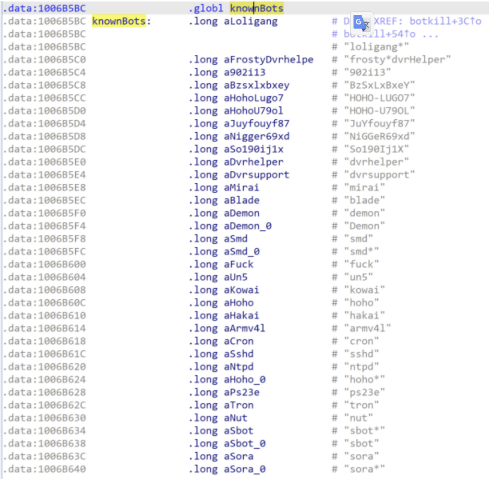

中翻英：https://www.notion.so/solymx/Worm-War-The-Botnet-Battle-for-IoT-Territory-8b18ac0cc23b4417bcb76aedc5355dae

## 摘要

產生殭屍網路的最主要三個 bot source codebases: 
- Mirai
- Kaiten
- Qbot 

## Introduction

攻擊者常打 Router 
- 主要：做 DDoS
- 其中好處：隱藏自身蹤跡
- 常見功能：先找尋其他惡意軟體，把它 Kill 掉 (獨享)
- 受害者：當 ip 被標為惡意，難以存取網路 (黑名單)

## What the Numbers Show

最常見攻擊：
- 暴力攻擊
- Telnet 遠端登入

**如果看到設備有嘗試去遠端登入用 telnet ，這是感染的指標**


## Mirai: The Grandfather

Mirai 
- 最常見
- 2016 年問世
- 開發目的為 ddos 工具販賣

會去找 .anime process ，並用 linux 指令 kill 去終止該 process (bot)
```
kill(pid, 9)
```
ref. 圖 5 
https://documents.trendmicro.com/assets/white_papers/wp-worm-war-the-botnet-battle-for-iot-territory.pdf

## Kaiten: A Tsunami of Attacks

kaiten
- 為一種 botnet 惡意程式家族
- 2001 年開源
- c2 協定走 IRC
- 又名 Tsunami
- 有使用一組帳號密碼清單做 telnet 暴力破解
- 如果路由器先前有感染舊版本，會先清除



ref. 圖 7
https://documents.trendmicro.com/assets/white_papers/wp-worm-war-the-botnet-battle-for-iot-territory.pdf


Kaiten 變種：
- Amnesia 
- Muhstik 
- Capsaicin 

## Qbot: The Third Brother

Qbot:
- 比 Mirai 年長
- 又名為
	- Bashlite
	- Gafgyt
	- Lizkebab 
	- Torlus
- c2 通訊用 tcp 相關協定，而非 irc
- 變種一樣具備 kill 其他殭屍網路惡意程式


殭屍網路惡意程式常見功能都會去 kill 對方，也就是對網路資源的競爭

底下為 Momentum iot malware 的一組要 kill 的 process 清單

ref. 圖 12
https://documents.trendmicro.com/assets/white_papers/wp-worm-war-the-botnet-battle-for-iot-territory.pdf


小整理 3 種殭屍網路惡意程式資料：
- Mirai
	- 開發出來目的為 DDoS 工具販賣
	- 開源，所以變種很多
	- 本身最早功能即有去 kill 別人
- Kaiten
	- 又名 Tsunami
	- c2 用 irc protocol
	- 支援多種硬體架構
	- 最新變種有加上 kill other botnet malware
- Qbot
	- 又名 Bashlite, Gafgyt, Lizkebab, Torlus
	- 支援多種硬體架構
	- c2 based on TCP protocol
	- 變種加上 kill other botnet malware


## 結論

建議 IT 使用者，定期：
- 檢查 LOG 有無可疑的登入紀錄
- 確保韌體是最新的
- 用強密碼
- 禁止遠端登入，僅允許本地登入
